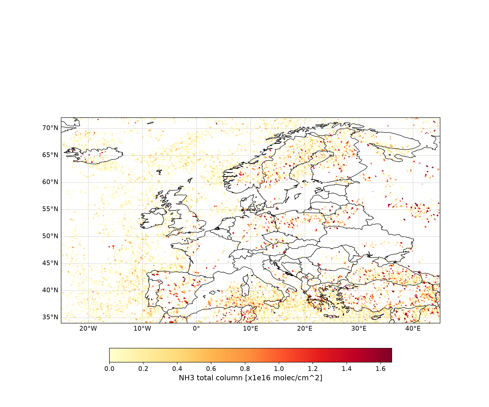

# IASI NH₃ Processing & Visualization

Turns raw IASI/METOP-C satellite ammonia (NH₃) retrievals into a clean,
QC-filtered, regridded time series — and plots it over Europe.

*(real output — mean NH3 total column over Europe from 3 sample days,
2023-01-01 to 2023-01-03)*

## Background

[IASI](https://www.eumetsat.int/iasi) (Infrared Atmospheric Sounding
Interferometer), flown on the EUMETSAT METOP satellites, retrieves daily
global atmospheric ammonia (NH₃) columns. The raw Level‑2 product comes as
one file per day, as irregularly-spaced ground pixels along the satellite
swath, with several quality flags. This project:

1. Filters each day for retrieval quality, daytime overpasses, and low
   cloud cover.
2. Regrids the swath data onto a fixed lat/lon grid.
3. Stacks every day into one combined NetCDF time series.
4. Plots the result over a chosen region (Europe by default).

It started as an exploratory Jupyter notebook (kept in `notebooks/`) and was
refactored into small, readable scripts.

## Project layout

```
iasi-nh3-processing/
├── config/config.yaml     # all the paths / years / QC thresholds / regions
├── iasi_nh3/
│   ├── functions.py       # data loading, masking, plotting helpers
│   ├── config.py           # tiny YAML config loader
│   ├── process.py          # main pipeline: raw files -> combined NetCDF
│   └── plot_europe.py      # combined NetCDF -> regional PNG
├── scripts/make_demo_image.py   # generates the preview image above
├── notebooks/               # original exploratory notebooks
├── assets/                  # demo_output.png
└── tests/
```

## Setup

```bash
git clone https://github.com/<your-username>/iasi-nh3-processing.git
cd iasi-nh3-processing
python -m venv .venv && source .venv/bin/activate   # Windows: .venv\Scripts\activate
pip install -r requirements.txt
```

`cartopy` (used for coastlines/borders) needs the GEOS/PROJ system
libraries; if `pip` struggles with it, `conda install -c conda-forge cartopy`
is the easier route.

## Data

Three sample days are meant to live in `data/METOP-C/2023/` (see
`data/README.md`) — enough to run the whole pipeline end-to-end without
needing the full multi-year archive. `config/config.yaml` already points at
this folder by default:

```yaml
data:
  base_dir: "data/METOP-C"
  file_pattern: "IASI_METOPC_L2_NH3_{date}_ULB-LATMOS_V4.0.0R.nc"
  dates: ["2023-01-01", "2023-01-02", "2023-01-03"]
  years: [2023]          # fallback if `dates` isn't set

  # Target regular lat/lon grid the swath data gets regridded onto,
  # generated in code - no external .mat file needed.
  grid:
    lonmin: -25
    lonmax: 45
    latmin: 34
    latmax: 72
    resolution_deg: 0.1
```

To use your own larger archive instead, just point `base_dir` at wherever
it lives (local path or another drive) and adjust `years`.

## Run

```bash
# 1. Build the combined, gridded NetCDF file
python -m iasi_nh3.process --config config/config.yaml

# 2. Plot Europe (mean over the processed days)
python -m iasi_nh3.plot_europe --config config/config.yaml

# ...or a single date
python -m iasi_nh3.plot_europe --config config/config.yaml --date 2023-01-02

# ...or any custom bounding box (lonmin lonmax latmin latmax)
python -m iasi_nh3.plot_europe --config config/config.yaml --bbox -10 30 35 60
```

Plots land in `outputs/plots/`.

## Tech

Python · xarray · netCDF4 · scipy (griddata regridding) · cartopy ·
matplotlib · PyYAML

## Acknowledgments

This project builds on EUMETSAT's LTPy (Learning tool for Python on
Atmospheric Composition Data) training materials:

- [`functions.ipynb`](https://gitlab.eumetsat.int/eumetlab/atmosphere/atmosphere/-/blob/master/functions.ipynb) —
  source of the data-reshaping/masking helpers adapted in `iasi_nh3/functions.py`
  (`generate_xr_from_1D_vec`, `generate_masked_array`, `generate_geographical_subset`,
  `visualize_pcolormesh`).
- [`231_Metop-AB_IASI_NH3_L2_load_browse.ipynb`](https://gitlab.eumetsat.int/eumetlab/atmosphere/atmosphere/-/blob/master/20_data_exploration/231_Metop-AB_IASI_NH3_L2_load_browse.ipynb) —
  the original IASI/METOP-A/B NH₃ Level‑2 data-discovery notebook this
  processing approach (loading, quality/cloud filtering, unit conversion)
  is based on.

Both are part of the [EUMETlab / atmosphere](https://gitlab.eumetsat.int/eumetlab/atmosphere/atmosphere)
repository, MIT licensed.

## Notes

- Raw IASI files and the `.mat` grid file aren't included (`.gitignore`) —
  they're large and machine-specific.
- `iasi_nh3/functions.py` adapts a couple of helper functions from
  EUMETSAT's LTPy training materials (MIT licensed) — see `LICENSE`.
